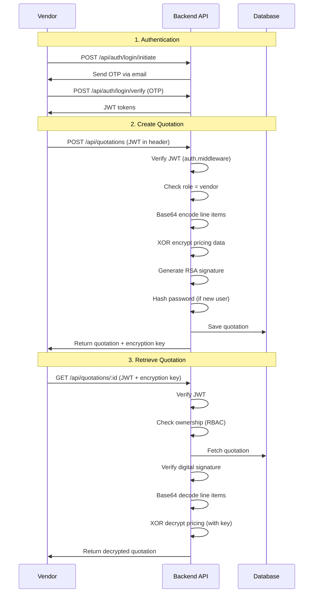

# Security Features Implementation Map

Comprehensive guide to all cybersecurity techniques implemented in the Secure Procurement System.

---

## 1. Base64 Encoding 📦

**Purpose**: Obfuscate quotation line items during storage and transmission

### Implementation
- **Utility**: [`utils/security/base64.util.ts`](file:///home/optimus/Documents/secure-procurement-system/backend/src/utils/security/base64.util.ts)
- **Methods**: 
  - `encode()` / `decode()` - Basic Base64
  - `encodeJSON()` / `decodeJSON()` - JSON objects
  - `encodeURL()` / `decodeURL()` - URL-safe encoding
  - `isBase64()` - Validation

### Where Used
| Location | Purpose |
|----------|---------|
| [quotation.controller.ts:L46](file:///home/optimus/Documents/secure-procurement-system/backend/src/controllers/quotation.controller.ts#L46) | **Encode** quotation line items before saving to database |
| [quotation.controller.ts:L203](file:///home/optimus/Documents/secure-procurement-system/backend/src/controllers/quotation.controller.ts#L203) | **Decode** line items when retrieving quotations |
| [quotation.controller.ts:L318](file:///home/optimus/Documents/secure-procurement-system/backend/src/controllers/quotation.controller.ts#L318) | **Decode** line items for signature verification |
| [security.controller.ts](file:///home/optimus/Documents/secure-procurement-system/backend/src/controllers/security.controller.ts) | Demo endpoints: `/api/security/base64/encode` & `/decode` |

**Example Flow**:
```typescript
// When creating quotation
const encodedLineItems = Base64Util.encodeJSON(lineItems);
// Store: "W3siaXRlbSI6IkxhcHRvcCIsInF1YW50aXR5IjoxMH1d"

// When retrieving quotation
const lineItems = Base64Util.decodeJSON(quotation.line_items);
// Returns: [{ item: "Laptop", quantity: 10 }]
```

---

## 2. XOR Encryption 🔐

**Purpose**: Symmetric encryption for sensitive quotation data (pricing, vendor info)

### Implementation
- **Utility**: [`utils/security/xor.util.ts`](file:///home/optimus/Documents/secure-procurement-system/backend/src/utils/security/xor.util.ts)
- **Key**: 32-character alphanumeric key (generated or from `.env`)
- **Methods**:
  - `encrypt()` / `decrypt()` - String encryption
  - `encryptJSON()` / `decryptJSON()` - JSON objects
  - `generateKey()` - Random key generation
  - `demonstrateXOR()` - Educational demo

### Where Used
| Location | Purpose |
|----------|---------|
| [quotation.controller.ts:L49-L55](file:///home/optimus/Documents/secure-procurement-system/backend/src/controllers/quotation.controller.ts#L49-L55) | **Encrypt** sensitive pricing data (total amount, vendor details) |
| [quotation.controller.ts:L212](file:///home/optimus/Documents/secure-procurement-system/backend/src/controllers/quotation.controller.ts#L212) | **Decrypt** when authorized user provides encryption key |
| [security.controller.ts](file:///home/optimus/Documents/secure-procurement-system/backend/src/controllers/security.controller.ts) | Demo endpoints: `/api/security/xor/encrypt` & `/decrypt` |

**Example Flow**:
```typescript
// When creating quotation
const encryptionKey = XORUtil.generateKey(); // "K7D2P9Z4YB..."
const sensitiveData = { totalAmount: 50000, vendorId: 123 };
const encrypted = XORUtil.encryptJSON(sensitiveData, encryptionKey);
// Store encrypted data + return key to user

// When retrieving (user must provide key)
const decrypted = XORUtil.decryptJSON(encrypted, userProvidedKey);
```

---

## 3. Hashing 🔒

**Purpose**: Data integrity verification and password security

### Implementation Files
- **SHA-256**: [`utils/security/hash.util.ts`](file:///home/optimus/Documents/secure-procurement-system/backend/src/utils/security/hash.util.ts)
- **bcrypt**: [`utils/security/hash.util.ts`](file:///home/optimus/Documents/secure-procurement-system/backend/src/utils/security/hash.util.ts)

### Where Used

#### SHA-256 (Data Integrity)
| Location | Purpose |
|----------|---------|
| [quotation.controller.ts:L62](file:///home/optimus/Documents/secure-procurement-system/backend/src/controllers/quotation.controller.ts#L62) | Hash quotation data before signing |
| [security.controller.ts](file:///home/optimus/Documents/secure-procurement-system/backend/src/controllers/security.controller.ts) | Demo: `/api/security/hash/generate` & `/verify` |

#### bcrypt (Password Hashing)
| Location | Purpose |
|----------|---------|
| [auth.controller.ts:L61](file:///home/optimus/Documents/secure-procurement-system/backend/src/controllers/auth.controller.ts#L61) | Hash password during registration |
| [auth.controller.ts:L152](file:///home/optimus/Documents/secure-procurement-system/backend/src/controllers/auth.controller.ts#L152) | Verify password during login |
| [auth.controller.ts:L351](file:///home/optimus/Documents/secure-procurement-system/backend/src/controllers/auth.controller.ts#L351) | Verify current password when changing |
| [auth.controller.ts:L382](file:///home/optimus/Documents/secure-procurement-system/backend/src/controllers/auth.controller.ts#L382) | Hash new password |

**Bcrypt Rounds**: Configured via `.env` (`BCRYPT_ROUNDS=12`)

---

## 4. Digital Signatures ✍️

**Purpose**: Ensure quotation authenticity and non-repudiation using RSA

### Implementation
- **Utility**: [`utils/security/signature.util.ts`](file:///home/optimus/Documents/secure-procurement-system/backend/src/utils/security/signature.util.ts)
- **Algorithm**: RSA-SHA256 (2048-bit keys)
- **Methods**:
  - `generateKeyPair()` - Create RSA public/private keys
  - `sign()` - Create digital signature
  - `verify()` - Verify signature authenticity

### Where Used
| Location | Purpose |
|----------|---------|
| [quotation.controller.ts:L59-L66](file:///home/optimus/Documents/secure-procurement-system/backend/src/controllers/quotation.controller.ts#L59-L66) | **Sign** quotation when created |
| [quotation.controller.ts:L230](file:///home/optimus/Documents/secure-procurement-system/backend/src/controllers/quotation.controller.ts#L230) | **Verify** signature when retrieving |
| [quotation.controller.ts:L326](file:///home/optimus/Documents/secure-procurement-system/backend/src/controllers/quotation.controller.ts#L326) | **Verify** signature on `/verify-signature` endpoint |
| [security.controller.ts](file:///home/optimus/Documents/secure-procurement-system/backend/src/controllers/security.controller.ts) | Demo: `/api/security/signature/create` & `/verify` |

**Signature Process**:
```typescript
// 1. Generate keys
const { publicKey, privateKey } = SignatureUtil.generateKeyPair();

// 2. Create signature from quotation data
const dataToSign = `${rfqId}-${vendorId}-${totalAmount}-${timestamp}`;
const signature = SignatureUtil.sign(dataToSign, privateKey);

// 3. Store signature + public key with quotation

// 4. Later: Verify signature
const isValid = SignatureUtil.verify(dataToSign, signature, publicKey);
```

---

## 5. Password Security 🛡️

**Purpose**: Analyze password strength, demonstrate vulnerabilities, enforce policies

### Implementation
- **Utility**: [`utils/security/password.util.ts`](file:///home/optimus/Documents/secure-procurement-system/backend/src/utils/security/password.util.ts)
- **Features**:
  - Strength analysis (score 0-5)
  - Common password detection
  - Entropy calculation
  - Password generation
  - Simulated cracking demonstrations

### Where Used
| Location | Purpose |
|----------|---------|
| [auth.controller.ts:L43](file:///home/optimus/Documents/secure-procurement-system/backend/src/controllers/auth.controller.ts#L43) | **Validate** password strength on registration (requires score ≥4) |
| [auth.controller.ts:L359](file:///home/optimus/Documents/secure-procurement-system/backend/src/controllers/auth.controller.ts#L359) | **Validate** new password strength when changing |
| [password-history.util.ts](file:///home/optimus/Documents/secure-procurement-system/backend/src/utils/security/password-history.util.ts) | Prevent password reuse (last 5 passwords) |
| [security.controller.ts](file:///home/optimus/Documents/secure-procurement-system/backend/src/controllers/security.controller.ts) | Demo: `/api/security/password/analyze`, `/crack`, `/generate` |

**Password Requirements**:
- Minimum score of 4/5 (Strong)
- Checks: length, uppercase, lowercase, numbers, symbols
- Cannot reuse last 5 passwords
- Expires every 90 days

---

## 6. JWT Tokens 🎫

**Purpose**: Stateless authentication and session management

### Implementation
- **Utility**: [`utils/jwt.util.ts`](file:///home/optimus/Documents/secure-procurement-system/backend/src/utils/jwt.util.ts)
- **Types**:
  - **Access Token**: 24h lifetime (user sessions)
  - **Refresh Token**: 7d lifetime (token renewal)
- **Secrets**: Stored in `.env`

### Where Used
| Location | Purpose |
|----------|---------|
| [auth.controller.ts:L80-L81](file:///home/optimus/Documents/secure-procurement-system/backend/src/controllers/auth.controller.ts#L80-L81) | **Generate** tokens on registration |
| [auth.controller.ts:L237-L238](file:///home/optimus/Documents/secure-procurement-system/backend/src/controllers/auth.controller.ts#L237-L238) | **Generate** tokens on login |
| [auth.controller.ts:L536-L537](file:///home/optimus/Documents/secure-procurement-system/backend/src/controllers/auth.controller.ts#L536-L537) | **Generate** tokens after OTP verification |
| [auth.controller.ts:L279](file:///home/optimus/Documents/secure-procurement-system/backend/src/controllers/auth.controller.ts#L279) | **Verify** refresh token |
| [auth.controller.ts:L282](file:///home/optimus/Documents/secure-procurement-system/backend/src/controllers/auth.controller.ts#L282) | **Generate** new access token |
| [auth.middleware.ts:L13](file:///home/optimus/Documents/secure-procurement-system/backend/src/middleware/auth.middleware.ts#L13) | **Verify** access token on protected routes |

**JWT Payload**:
```typescript
{
  userId: 123,
  email: "user@example.com",
  role: "vendor"
}
```

---

## 7. Rate Limiting ⏱️

**Purpose**: Prevent brute force attacks and API abuse

### Implementation
- **Middleware**: [`middleware/rate-limiter.middleware.ts`](file:///home/optimus/Documents/secure-procurement-system/backend/src/middleware/rate-limiter.middleware.ts)
- **Library**: `express-rate-limit`
- **Configuration** (`.env`):
  - Window: 15 minutes (900,000 ms)
  - Max requests: 100 per window

### Where Used
| Location | Purpose |
|----------|---------|
| [server.ts:L38-L42](file:///home/optimus/Documents/secure-procurement-system/backend/src/server.ts#L38-L42) | **Global limiter** applied to all `/api/*` routes |

**Behavior**:
- Tracks requests by IP address
- Returns `429 Too Many Requests` when limit exceeded
- Automatically resets after window expires

---

## 8. Helmet 🪖

**Purpose**: Set secure HTTP headers to prevent common web vulnerabilities

### Implementation
- **Library**: `helmet`
- **Applied**: [server.ts:L31](file:///home/optimus/Documents/secure-procurement-system/backend/src/server.ts#L31)

### Headers Set
- `X-Content-Type-Options: nosniff` - Prevent MIME sniffing
- `X-Frame-Options: SAMEORIGIN` - Clickjacking protection
- `X-XSS-Protection: 1; mode=block` - XSS protection
- `Strict-Transport-Security` - Force HTTPS
- And more...

---

## 9. CORS 🌐

**Purpose**: Control cross-origin access to the API

### Implementation
- **Library**: `cors`
- **Applied**: [server.ts:L32-L35](file:///home/optimus/Documents/secure-procurement-system/backend/src/server.ts#L32-L35)

**Configuration**:
```typescript
cors({
    origin: process.env.CORS_ORIGIN || 'http://localhost:3000',
    credentials: true
})
```

Only allows requests from the frontend origin specified in `.env`.

---

## 10. Role-Based Access Control (RBAC) 👥

**Purpose**: Fine-grained permissions based on user roles

### Roles
- **Admin**: Full system access
- **Vendor**: Submit quotations
- **Approver**: Review and approve/reject quotations

### Implementation
- **Middleware**: [`middleware/auth.middleware.ts`](file:///home/optimus/Documents/secure-procurement-system/backend/src/middleware/auth.middleware.ts)
- **Functions**:
  - `authenticate()` - Verify JWT token
  - `requireRole()` - Enforce specific role(s)
  - `authorizeQuotationAccess()` - Check quotation ownership

### Where Used

#### Route Protection Examples

**Vendor-Only Routes**:
```typescript
// quotation.routes.ts
router.post('/', authenticate, requireRole(['vendor']), createQuotation);
```

**Approver-Only Routes**:
```typescript
// approval.routes.ts
router.post('/:id/approve', authenticate, requireRole(['approver']), approve);
```

**Admin Routes**:
```typescript
// rfq.routes.ts
router.post('/', authenticate, requireRole(['admin']), createRFQ);
```

**Multi-Role Access**:
```typescript
// quotation.routes.ts  
router.get('/:id', authenticate, requireRole(['vendor', 'admin', 'approver']), getQuotation);
```

#### Resource-Level Authorization
| Location | Check |
|----------|-------|
| [quotation.controller.ts](file:///home/optimus/Documents/secure-procurement-system/backend/src/controllers/quotation.controller.ts) | Vendors can only view/edit their own quotations |
| [approval.controller.ts](file:///home/optimus/Documents/secure-procurement-system/backend/src/controllers/approval.controller.ts) | Approvers can only approve quotations in their level |
| [rfq.controller.ts](file:///home/optimus/Documents/secure-procurement-system/backend/src/controllers/rfq.controller.ts) | Admins can manage all RFQs |

---

## Security Flow Example: Complete Quotation Lifecycle



---

## Configuration Files

### Environment Variables (`.env`)
```bash
# JWT
JWT_SECRET=9fA3kLxQ2VwR8mPZ7D6C1HnB0YtJ4sE5
JWT_EXPIRES_IN=24h

# XOR Encryption
XOR_ENCRYPTION_KEY=K7D2P9Z4YB6X1L8A5M0CWEJHNRQSFTV

# Password Hashing
BCRYPT_ROUNDS=12

# Rate Limiting
RATE_LIMIT_WINDOW_MS=900000
RATE_LIMIT_MAX_REQUESTS=100

# CORS
CORS_ORIGIN=http://localhost:3000
```

---

## Testing Security Features

All security features have demo endpoints under `/api/security/*`:

| Endpoint | Method | Description |
|----------|--------|-------------|
| `/api/security/base64/encode` | POST | Encode text to Base64 |
| `/api/security/base64/decode` | POST | Decode Base64 string |
| `/api/security/xor/encrypt` | POST | XOR encrypt with key |
| `/api/security/xor/decrypt` | POST | XOR decrypt with key |
| `/api/security/hash/generate` | POST | Generate SHA-256/bcrypt hash |
| `/api/security/hash/verify` | POST | Verify hash matches data |
| `/api/security/signature/create` | POST | Create RSA signature |
| `/api/security/signature/verify` | POST | Verify RSA signature |
| `/api/security/password/analyze` | POST | Analyze password strength |
| `/api/security/password/crack` | POST | Demonstrate cracking |
| `/api/security/password/generate` | POST | Generate secure password |

**Routes file**: [routes/security.routes.ts](file:///home/optimus/Documents/secure-procurement-system/backend/src/routes/security.routes.ts)

---

## Additional Security Measures

### 1. Account Lockout
- **Location**: [auth.controller.ts:L132-L141](file:///home/optimus/Documents/secure-procurement-system/backend/src/controllers/auth.controller.ts#L132-L141)
- **Trigger**: 5 failed login attempts
- **Duration**: 30 minutes

### 2. Password Expiration
- **Location**: [auth.controller.ts:L206](file:///home/optimus/Documents/secure-procurement-system/backend/src/controllers/auth.controller.ts#L206)
- **Period**: 90 days (configurable)
- **Warning**: 7 days before expiry

### 3. OTP-Based 2FA
- **Utility**: [utils/otp.util.ts](file:///home/optimus/Documents/secure-procurement-system/backend/src/utils/otp.util.ts)
- **Expiry**: 5 minutes
- **Max attempts**: 3
- **Email service**: [services/email.service.ts](file:///home/optimus/Documents/secure-procurement-system/backend/src/services/email.service.ts)

### 4. Security Event Logging
- **Location**: Throughout authentication and authorization
- **Table**: `security_events`
- **Tracked events**:
  - Failed login attempts
  - Account lockouts
  - Password changes
  - Unauthorized access attempts
